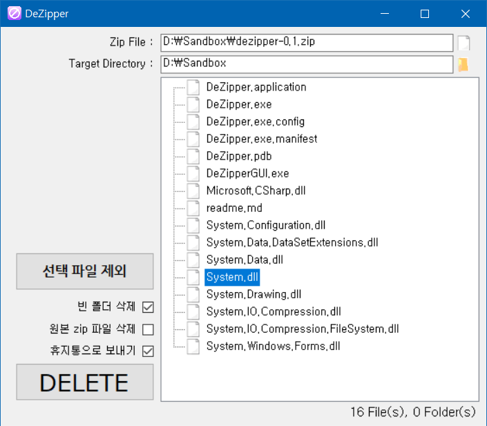

# DeZipper

## 1. 개요

DeZipper는 zip 파일에 포함된 파일 리스트를 읽은 다음, 원하는 폴더 아래에서 삭제 작업을 수행하는 프로그램입니다.

## 2. 구성

 * DeZipper는 두 개의 실행 파일(*.exe) 파일을 포함합니다.  
 * DeZipper.exe는 CUI 환경에서 사용할 수 있는 실행 파일입니다.  
 * DeZipperGUI.exe 실행 파일은 GUI로 구성되어 있습니다.  

## 3. 사용
### GUI 화면

### CUI 사용법
 * `DeZipper.exe [source_zip]`  
 [source_zip] 에서 파일 리스트를 읽어 출력합니다.
 * `DeZipper.exe [source_zip] [target_dir]`  
 [source_zip] 에서 파일 리스트를 읽어서 [target_dir] 에서 삭제합니다.
 * `DeZipper.exe [source_zip] [target_dir] [options]`  
 [options] 에 따라 옵션을 설정할 수 있습니다. [options] 는 띄어쓰기로 구분됩니다.

#### CUI 옵션
 옵션은 파일을 삭제 할 때에만 사용 가능합니다.  
 * -s, -silence  
 에러 메세지를 제외한 나머지 메세지를 출력하지 않습니다.  
 * -e, -empty  
 파일 삭제 후 파일 리스트에 존재하는 폴더 중 빈 폴더를 삭제합니다.  
 * -z, -zip  
 파일 삭제 후 사용된 zip 파일을 삭제합니다.  
 * -r, -recycler  
 파일들을 삭제하는 대신 휴지통으로 보냅니다.  
 * -ex [file], -exclude [file]  
 삭제할 파일 리스트에서 [file] 을 제외합니다. 여러 파일을 제외할 경우 띄어쓰기로 구분합니다. 다중 옵션 사용 시 해당 옵션은 마지막에 위치하는 것을 권장합니다.  
   제외할 파일을 찾지 못한 경우 삭제는 진행되지 않습니다.  
 * -h, -help  
 readme.md 파일을 출력합니다.  

## 4. 주의
휴지통으로 보내지 않고 완전히 삭제한 파일은 복구가 불가능하므로 사용에 주의해 주세요.

## Credit
Auth : anteater333 (@ Github.com)  
E-mail : zx1056@naver.com

## Change Log
2017-11-30, v0.1  
 : DeZipper Initial Release  
2020-08-18, v0.2  
 : 휴지통으로 보내기 기능 구현
